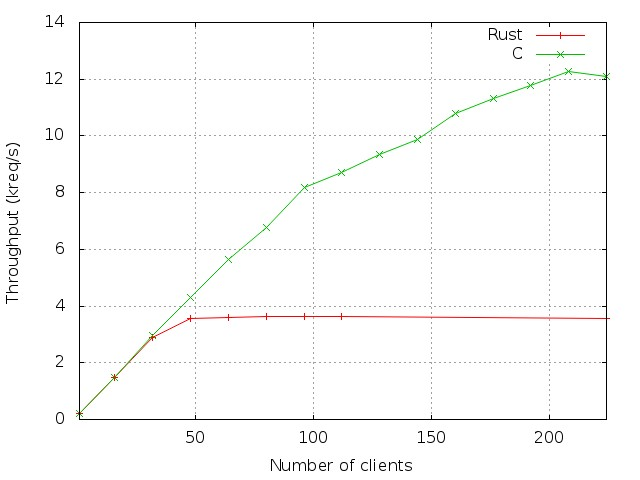

Simple Web Server evaluation
============================

In this document we present a performance analysis of the Rust and C implementation of the web server. Our results show that the Rust server provides bad performance. This performance seems to be related to Rust internal rather than the web server code.

Experimental settings
---------------------

We evaluate the performance of the servers on a cluster composed of 15 identical machines. These machines host two quad-core Intel Xeon E5440 clocked at 2.83GHz, 8GB of RAM and an Hitachi HDT72502 of 250GB running at 7200rpm. They are all connected via a Gigabit network. They run a Linux kernel 3.2 and embed gcc v4.4.5 and Rust v0.6. One machine acts as the server, while the other ones act as clients.

We configure several kernel parameters to get the best performance :

    fs.file-max=786762
    net.core.netdev_max_backlog=400000
    net.core.optmem_max=10000000
    net.core.rmem_default=10000000
    net.core.rmem_max=10000000
    net.core.wmem_default=10000000
    net.core.wmem_max=10000000
    net.core.somaxconn=10000
    net.ipv4.conf.all.rp_filter=1
    net.ipv4.conf.default.rp_filter=1
    net.ipv4.tcp_congestion_control=cubic
    net.ipv4.tcp_ecn=0
    net.ipv4.tcp_max_syn_backlog=10000
    net.ipv4.tcp_max_tw_buckets=1800000
    net.ipv4.tcp_mem=10000000 10000000 10000000
    net.ipv4.tcp_rmem=10000000 10000000 10000000
    net.ipv4.tcp_wmem=10000000 10000000 10000000
    net.ipv4.tcp_sack=1
    net.ipv4.tcp_syncookies=0
    net.ipv4.tcp_timestamps=1
    net.ipv4.tcp_tw_recycle=1
    net.ipv4.tcp_fin_timeout=1

As the C implementation uses mmap to get the files content, we increase the maximum number of mappings on the web server:

    $ cat /proc/sys/vm/max_map_count 
    1000000

Finally, the web server are compiled with optimizations (-O2 for C, -O for Rust) and are configured to serve 1000 files of the same size, present in the same directory. Each thread is pinned to a different core. The clients, which are curl processes, access 1 file chosen at random at a time. Each experiment last 1 minute and is run several times: the standard deviation is less than 2%.

Throughput with requests of 1kiB
--------------------------------

In this section we present the performance of the two implementations. The servers pool size is 1 and the files size is 1kiB.
Figure  shows the throughput (in terms of served requests per second) for both implementation as a function of the number of clients.
We observe that, up to 32 clients, both implementation provide the same performance.
Moreover, the C implementation performance increases almost linearly, for a peak throughput of 12.2kreq/s, while the Rust implementation peak throughput is reached with only 48 clients, for a throughput of 3.6kreq/s.
Finally, the C implementation outerpforms the Rust implementation by a factor of 3.4.

One difference between both implementation is the usage of mmap to read files. We suppose that the Rust bad performance could be related to not using mmap. As a consequence we run an experiment where the Rust web server does not read files on disk. Instead, it sends a pre-allocated vector of bytes to the client. We observed a small performance increase: from 3.6kreq/s to 4kreq/s (+11%). We conclude that the bad performance of the web server is not (entirely) due to how files are read.

Conclusions
-----------

As we have seen, the C implementation outperforms the Rust implementation by a factor of 3.4 for files of 1kB. We suppose this performance difference is due to Rust internals (either the compiler, the event-processing loop or the tasks scheduler).

We would like to have a Rust profiler in order to understand this performance problem.
